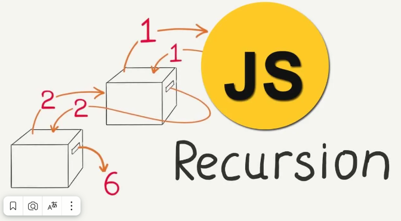
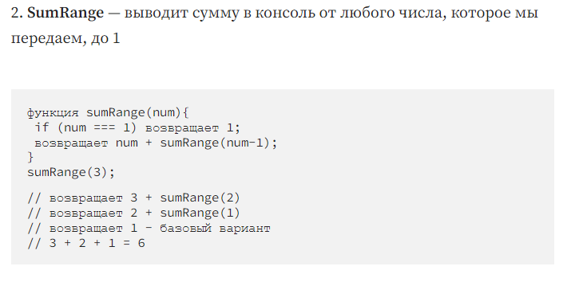

# Рекурсия в JavaScript

## Что такое рекурсия?
Процесс ( в нашем случае функция ), который вызывает сам себя.

Зачем нам знать рекурсию?
Это ПОВСЮДУ!

Методы, использующие внутреннюю рекурсию — JSON.parse/JSON.stringify, document.getElementById
Алгоритмы обхода DOM и Object traversal
Более чистая альтернатива итерации.

### Стек вызовов — Сначала давайте поговорим о функциях. Почти во всех языках программирования существует встроенная структура данных, которая управляет тем, что происходит при вызове функций. В JavaScript она называется стеком вызовов.

### Это стековая структура данных. Каждый раз, когда вызывается функция, она помещается (выталкивается) наверх стека вызовов. Когда JavaScript увидит ключевое слово return или когда функция завершится, компилятор удалит (pop).

# Как работают рекурсивные функции?
Две важные части любых рекурсивных функций — базовый регистр и разные входные данные. Вызывайте ту же функцию с другими входными данными, пока не дойдете до базового варианта — условия, при котором рекурсия заканчивается.

# Советы по чистой рекурсии

Для массивов используйте такие методы, как slice, оператор spread и concat, которые создают копии массивов, чтобы мы не изменяли их.
Помните, что строки неизменяемы, поэтому нам нужно будет использовать такие методы, как slice, substr или substring для создания копий строк.
Для создания копий объекта используйте Object.assign или оператор spread .