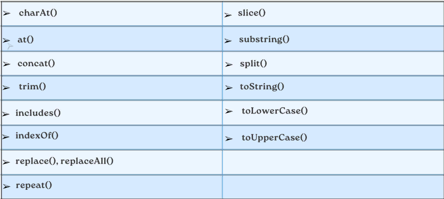

# Рекурсия в JavaScript

## Что такое рекурсия?
Процесс ( в нашем случае функция ), который вызывает сам себя.

Зачем нам знать рекурсию?
Это ПОВСЮДУ!

Методы, использующие внутреннюю рекурсию — JSON.parse/JSON.stringify, document.getElementById
Алгоритмы обхода DOM и Object traversal
Более чистая альтернатива итерации.

### Стек вызовов — Сначала давайте поговорим о функциях. Почти во всех языках программирования существует встроенная структура данных, которая управляет тем, что происходит при вызове функций. В JavaScript она называется стеком вызовов.

### Это стековая структура данных. Каждый раз, когда вызывается функция, она помещается (выталкивается) наверх стека вызовов. Когда JavaScript увидит ключевое слово return или когда функция завершится, компилятор удалит (pop).

# Как работают рекурсивные функции?
Две важные части любых рекурсивных функций — базовый регистр и разные входные данные. Вызывайте ту же функцию с другими входными данными, пока не дойдете до базового варианта — условия, при котором рекурсия заканчивается.

# Советы по чистой рекурсии

Для массивов используйте такие методы, как slice, оператор spread и concat, которые создают копии массивов, чтобы мы не изменяли их.
Помните, что строки неизменяемы, поэтому нам нужно будет использовать такие методы, как slice, substr или substring для создания копий строк.

# Lecture 4

# String - Строка -Сатр

### Объект String используется для представления последовательности символов и манипулирования ею.

Строки полезны для хранения данных, которые могут быть представлены в текстовой форме. Некоторые из наиболее часто используемых операций со строками - это проверка их length, построение и конкатенация их с помощью + и += строковых операторов, проверка существования или расположения подстрок с помощью indexOf() метода или извлечение подстрок с помощью substring() метода

STRING - 3 ТАРЗ МЕШАВА 
1. Double - " Hello " ;
2. Single - 'Hello ' ;
2. Bacticks - ' ${ hi } ' ;

## String - Методхои худро дорад ин методхо:

## Nambers - Метод

1 Math.floor()
2 Math.round()
3 Math.ceil()

# Lecture 5

# Array - Масив дар Java Script
###  Масив набор тип элементое мебошад ки хама намуд элементора да хдш кабул мекна.

## Let Array = [ item1 , item2 . . . itemN ]

В JavaScript существует множество методов массива. Вот некоторые из них:

`length` — возвращает количество элементов в массиве.

`reverse()` — возвращает массив в обратном порядке.

`sort()` — сортирует элементы массива в определённом порядке.

`fill()` — возвращает массив, заполняя элементы заданным значением.

`join()` — объединяет элементы массива в строку.

`toString()` — возвращает строковое представление массива.

`pop()` — удаляет и возвращает последний элемент массива.

`shift()` — удаляет и возвращает первый элемент массива.

`push()` — добавляет элементы в конец массива и возвращает его длину.

`unshift()` — добавляет элементы в начало массива и возвращает длину.
